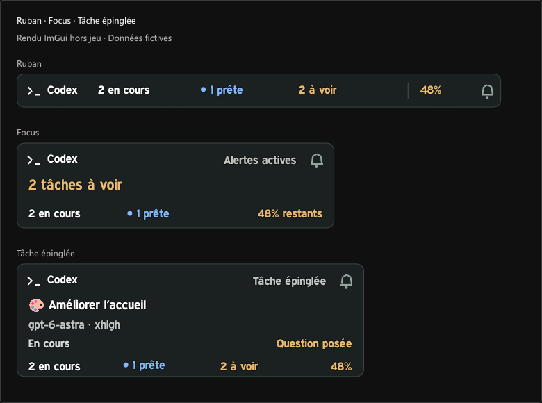
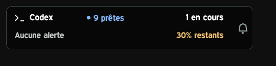
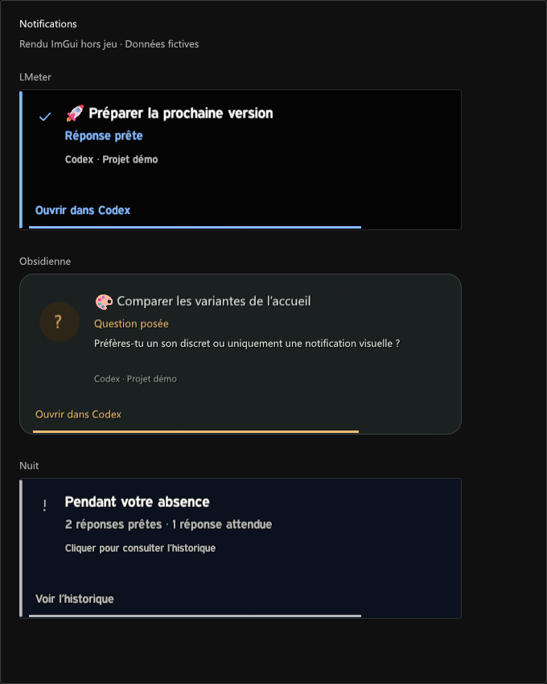
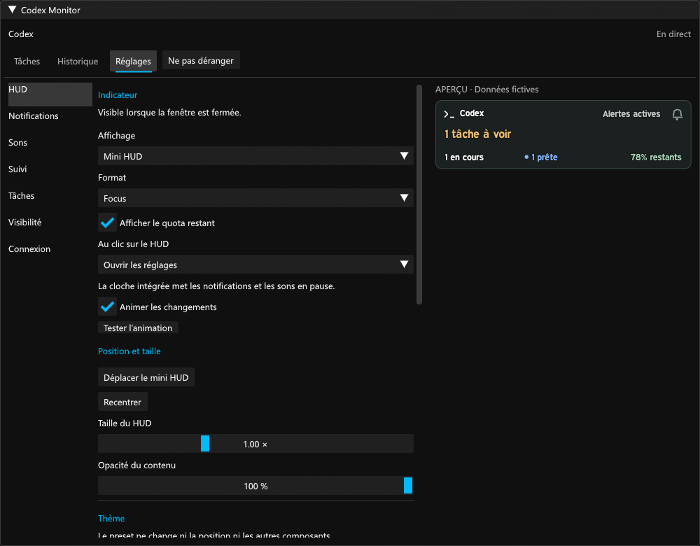

# Codex Monitor

Vos tâches Codex dans FF14 : travail en cours, réponses non lues, questions, notifications et quota restant.

Le modèle et l’effort apparaissent sous chaque tâche. Le point bleu suit celui de Codex ; une **Question posée** reste distincte de l’état **En cours**.


*Rendus ImGui hors jeu, avec des données fictives.*

## Installation

Version expérimentale pour **Windows et Dalamud 15**.

1. Dans `/xlsettings`, ouvrir **Dépôts de plugins personnalisés**, ajouter cette URL et activer la ligne :

```text
https://raw.githubusercontent.com/Aleqsd/dalamud-plugins/main/repo.json
```

2. Dans `/xlplugins`, installer **Codex Monitor**. Les mises à jour passent ensuite par le même écran.
3. Ouvrir `/codex`, puis **Réglages → Connexion → Lancer le relais**.

Node.js 22.22.2 minimum et Codex sont nécessaires ; le quota utilise le compte connecté au CLI Codex. Le lancement automatique du relais à la connexion au personnage est facultatif et désactivé par défaut.

Après la mise à jour **0.11.0**, relancer le relais intégré pour recevoir les extraits des questions. Un relais externe reste géré séparément : mettre à jour ses fichiers et le relancer depuis son dossier. [Détails du relais](bridge/README.md).

Si tu utilisais une DLL de développement, désactiver cette copie et retirer uniquement son entrée de **Dev Plugin Locations**. Conserver la configuration et une seule copie chargée.

## Mini HUD

**Focus** met l’information prioritaire au premier plan. **Ruban** tient sur une ligne. **Tâche épinglée** suit une tâche précise avec son modèle et son effort. Les six formats précédents restent disponibles, et ton choix actuel est conservé.



Cliquer sur le mini HUD ouvre les **réglages**, y compris sur ses compteurs et son quota. La **cloche intégrée** donne accès à Ne pas déranger. Pour choisir l’aperçu des tâches à la place, utiliser **Réglages → HUD → Au clic sur le HUD → Aperçu des tâches** ; ses boutons permettent ensuite d’ouvrir une tâche dans Codex. La 0.11.1 rétablit l’ouverture des réglages pour les configurations de la 0.11.0.

Le menu d’une tâche permet de l’épingler dans le HUD, de l’ajouter aux favoris, de couper temporairement ses alertes ou de masquer une ancienne question. **Réglages → Suivi** sélectionne les projets suivis.

La cloche à l’intérieur du HUD ouvre **Ne pas déranger** : 15 min, 30 min, 1 h ou la session. Les compteurs et l’historique continuent ; notifications et sons attendent. `/codex dnd 30` et `/codex dnd off` donnent le même accès.

Le texte des HUD utilise **Expressway 16** avec un contour noir lorsque la police est disponible localement, notamment dans LMeter. Les petits libellés sont plus lisibles. **Réglages → HUD → Texte lisible comme LMeter** restaure ce rendu sans changer le fond ni la position. Le plugin fournit une police de secours si Expressway est absente ; aucun fichier de police n’est inclus.



## Notifications et réglages

Le titre de la tâche apparaît d’abord, puis l’événement et, si disponible, un extrait de sa question. Les extraits sont facultatifs et ne sont pas enregistrés dans l’historique. Les réponses et les sorties d’outils ne sont pas transmises au jeu.



**Réglages** rassemble le HUD, les notifications, les sons, le suivi, la liste des tâches, la visibilité et la connexion. L’aperçu reste visible pendant les réglages. Les thèmes LMeter, Obsidienne et Nuit personnalisent les éléments du plugin ; les réglages gardent leur présentation fixe.



`/codex preview` place les notifications. L’écran titre, les chargements, les cinématiques et le mode photo masquent le plugin par défaut. Les alertes rapprochées sont regroupées ; après un combat, leur durée de lecture est conservée. L’historique propose recherche et filtres.

Dans **Connexion**, choisir la période du quota, ses seuils d’alerte ou **Vérifier la connexion**. Une donnée inconnue reste « — ».

Le relais utilise un protocole interne de Codex qui peut évoluer. Le plugin ne lance ni n’approuve de tâche et n’écrit pas dans l’état de lecture de Codex.

[Compilation](docs/DEVELOPMENT.md) · [Validation](docs/VALIDATION.md) · [Notifications](docs/NOTIFICATIONS.md)
