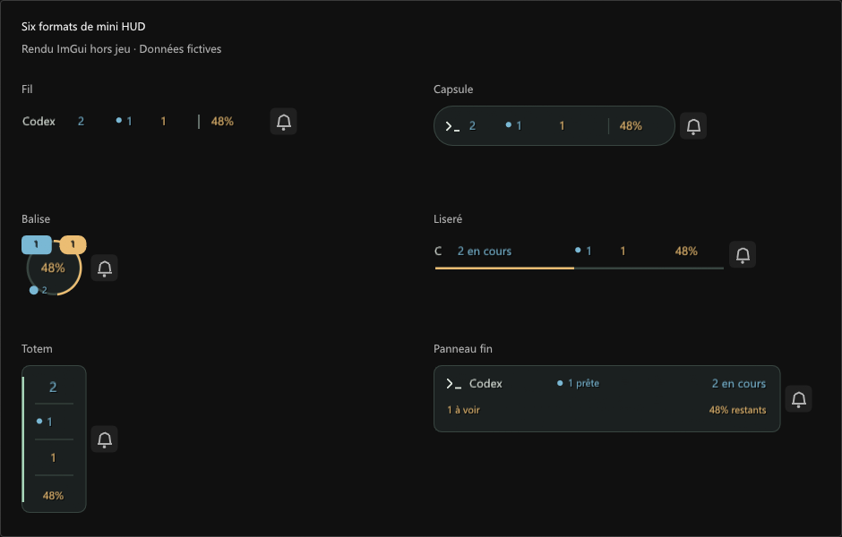

# Codex Monitor


Vos tâches Codex dans FF14 : état du travail, questions en attente, notifications et quota restant.

Le modèle et son effort apparaissent sous chaque tâche, par exemple `gpt-6-astra · xhigh`. Le point bleu suit celui de Codex : **Prêtes** regroupe les réponses non lues ; **En cours** indique le travail actif. Lire dans Codex actualise cet indicateur dans FF14.


*Aperçu ImGui hors jeu, avec des données fictives.*

## Installation

Version expérimentale pour **Windows et Dalamud 15**, disponible dans le dépôt personnalisé d’Aleqsd.

1. Dans les paramètres Dalamud (`/xlsettings`), ouvrir **Dépôts de plugins personnalisés**.
2. Ajouter cette URL, activer la ligne et enregistrer :

```text
https://raw.githubusercontent.com/Aleqsd/dalamud-plugins/main/repo.json
```

3. Dans `/xlplugins`, chercher **Codex Monitor** et cliquer sur **Installer**. Les versions ajoutées à ce catalogue se mettent ensuite à jour depuis Dalamud.

Si tu utilisais une DLL de développement, désactive cette copie et retire uniquement son entrée de **Dev Plugin Locations** avant l’installation. Conserve tes fichiers de configuration et une seule copie chargée.

Ouvrir **Réglages → Connexion → Lancer le relais**, ou activer **Lancer le relais automatiquement à la connexion au personnage**. Cette option est désactivée par défaut. Les scripts sont inclus ; Node.js 22.22.2 minimum et Codex restent nécessaires, ainsi qu’un CLI Codex connecté pour le quota. Le relais démarre sans console et réutilise une instance déjà active. [Fonctionnement et lancement séparé](bridge/README.md).

## Utilisation

`/codex` ouvre les tâches. `/codex config` règle le HUD, les notifications, les sons et l’apparence. `/codex preview` place les notifications.

La fenêtre reste fermée au chargement. Dans **Réglages → Visibilité**, choisir quand masquer le plugin : écran titre, chargements, cinématiques et mode photo par défaut ; combats et instances en option. Les alertes de l’écran titre ne sont pas rejouées à la connexion.

Cliquer sur une tâche avec un « ? » permet de masquer sa question dans FF14 ou de la réafficher. Les nouvelles questions restent signalées.

Le même menu permet d’ajouter un favori ou de mettre une tâche en silence pendant 30 min ou 1 h. **Réglages → Suivi** choisit les projets suivis. L’historique propose recherche, filtres et regroupement par tâche.

**Ouvrir** dans la liste, ou **Ouvrir dans Codex** sur une notification, ouvre directement la tâche dans l’application Codex. Les titres affichent les emojis en couleur avec la police Windows.

Dans **Notifications → Design**, personnaliser le fond, la transparence, les coins, les icônes et le texte avec un aperçu. LMeter, Obsidienne et Nuit habillent les éléments du plugin ; les réglages gardent une présentation fixe. Expressway est facultative et locale, avec repli Dalamud.

Le relais utilise un protocole interne de Codex qui peut évoluer. Le plugin ne lance ni n’approuve de tâche.

## Mini HUD

Six formats, du simple texte au panneau compact, avec les tâches actives, les questions et le quota restant.

Cliquer sur un compteur ouvre sa liste : tâches en cours, réponses prêtes ou demandes à voir. Le pourcentage ouvre les détails du quota. Dans **Connexion**, choisir les seuils d’alerte et utiliser **Vérifier la connexion** en cas de problème.

Le **Panneau fin** affiche le pourcentage sans barre : vert au-dessus de 50 %, ambre de 20 à 50 %, rouge sous 20 %. Une valeur inconnue reste grise.

Dans **Connexion**, choisir la semaine, la période courte ou la période la plus limitante. Le survol montre les deux périodes ; un astérisque rouge signale qu’une autre période est épuisée.



La **cloche** ouvre **Ne pas déranger** : 15 min, 30 min, 1 h ou jusqu’à réactivation pendant cette session. Les tâches et l’historique restent à jour ; les notifications et sons attendent, puis un résumé paraît au retour au calme. Cliquer sur la cloche barrée reprend les alertes ; le clic droit permet de prolonger la pause. Raccourcis : `/codex dnd 30` et `/codex dnd off`.


## Notifications

Réponse prête, question posée ou résumé au retour du combat. Voici les thèmes LMeter, Obsidienne et Nuit :

Les alertes rapprochées d’une tâche sont regroupées sur deux secondes. Les erreurs sont prioritaires ; une alerte dépassée disparaît. Pour le modèle, l’effort et le point bleu, utiliser le relais inclus dans la **0.10.0 ou une version plus récente**. Un ancien relais affiche « — » pour l’indicateur qu’il ne fournit pas.


*Ces aperçus proviennent des composants ImGui réels, hors jeu, avec des données fictives.*

[Compilation et fonctionnement](docs/DEVELOPMENT.md) · [Validation](docs/VALIDATION.md) · [Notifications](docs/NOTIFICATIONS.md)
