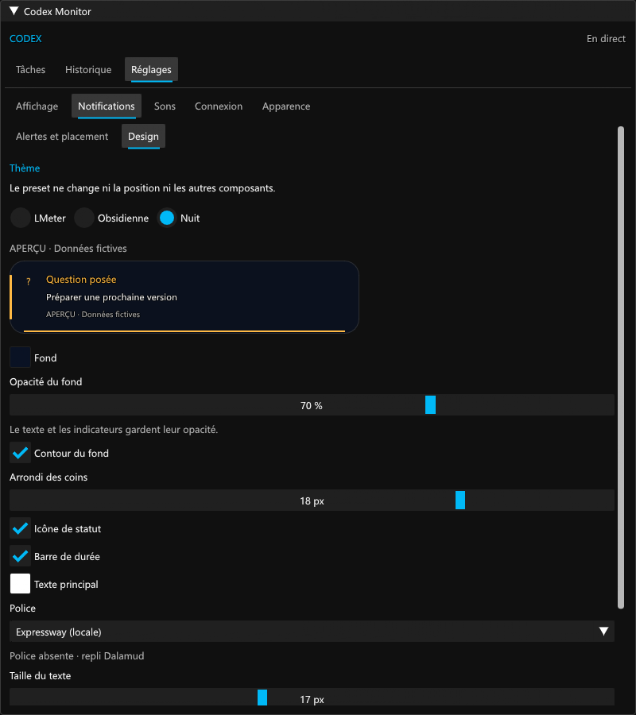
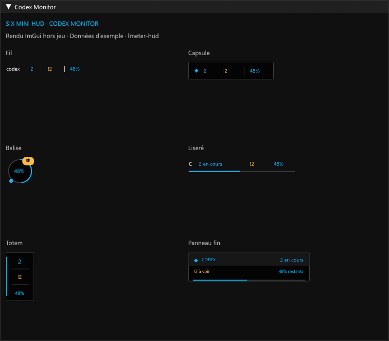

# Validation 0.6.1

Prérelease expérimentale. Vérifications locales le 7 septembre 2026 sur Windows, Dalamud 15.0.3.2, .NET SDK 10.0.400 et Node.js 22.22.2.

- Compilation sans erreur ni avertissement ; 141 contrôles C# et 20 tests Node passent, avec lecture du relais réel.
- Les 17 nouveaux contrôles logiques couvrent le masquage exact d’une question, la persistance, les nouvelles questions, les interventions bloquantes, les compteurs, l’historique, les notifications et la restauration silencieuse.
- 32 interactions ImGui hors jeu passent : 13 pour questions/design/texte, 6 pour navigation et indicateurs, 5 pour le HUD, 2 pour ses animations et 6 pour son fond.
- Le sérialiseur Newtonsoft.Json installé dans Dalamud valide les anciens champs, les nouveaux choix et leur rechargement ; 18 contrôles d’apparence/géométrie et les contrôles de migration du fond passent également.
- Le panneau de connexion est identique pixel par pixel après modification de la police, taille, couleur, transparence et marges de l’ancien champ `WindowAppearance`, ainsi que des thèmes HUD/notifications. La personnalisation des données ne déborde plus sur les réglages.
- 74 images sont produites depuis les composants réels : 32 vues de cette évolution et 42 vues générales, avec données fictives, largeur minimale et échelles 100/150/200 %. Le bas du formulaire de design reste accessible par défilement.
- Le vrai composant de notification conserve sa durée complète après un combat simulé, y compris après une brève sortie de combat.

Les rendus utilisent les composants C# réels et un rasteriseur CPU des triangles ImGui. Les services hôtes sont simulés, avec Segoe UI et Consolas installées localement. Ils ne constituent pas un essai dans FF14.

## Limites

La DLL 0.6.1 n’a pas été chargée ou testée en jeu pendant cette validation. Le cycle de vie des polices via l’atlas géré de Dalamud reste à vérifier pendant une session. Expressway est absente de l’environnement de test : le repli est montré, son fichier n’est ni testé ni distribué.

Le masquage d’une question est uniquement local à FF14. Il ne la résout pas dans Codex et ne masque pas une demande bloquante. Le relais conserve son fonctionnement ; aucune mise à jour ou relance du relais 0.6.0 n’est nécessaire pour cette version.

Le protocole interne de Codex Windows peut évoluer. Le plugin ne lance, n’interrompt, ne répond et n’approuve aucune tâche.

## Images

Aperçus ImGui hors jeu avec données fictives.
