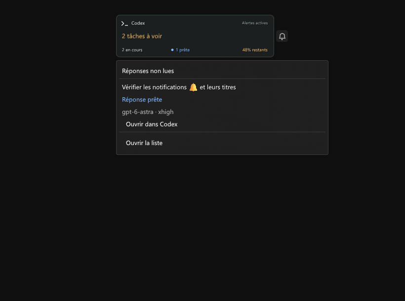

# Validation 0.11.0

Vérifications locales le 7 septembre 2026 : Windows, Dalamud 15.0.3.2, .NET SDK 10.0.400 et Node.js 22.22.2. Distribution expérimentale dans le dépôt personnalisé.

- **260 contrôles C#** : contrat, métadonnées, lecture, extraits bornés, suppression des questions résolues, historique sans extraits, quota, rafales, pauses, reconnexion et géométrie des neuf HUD.
- **25 tests Node** : flux local, projection autorisée, questions et extraits, réponses partielles, fragments historiques, perte du propriétaire, quota et journaux bornés.
- **32 contrôles Unicode et liens**, plus **16 contrôles du lanceur Node**.
- **556 contrôles ImGui et 109 rendus** : neuf HUD à 100/150/200 %, compteurs cliquables, aperçus, ouverture explicite de la tâche, pause, épinglage, navigation latérale, largeur minimale, absence de données et grands compteurs. Comparaison pixel à pixel des réglages avant/après personnalisation des éléments et migration avec Newtonsoft.Json fourni par Dalamud.
- Trois planches du README sont dessinées par les composants natifs, avec des données fictives.

Le relais intégré 0.11.0 a été lancé temporairement sur le port libre 43187 puis arrêté proprement. Le contrat a confirmé sa version, le modèle, l’effort, l’état de lecture et un quota disponible. Le diagnostic guidé a vérifié Node et Codex. Aucun autre relais n’a été arrêté ou remplacé.

Les extraits sont vérifiés sur des questions structurées fictives et leurs patches : édition, réponse partielle, disparition et perte de fraîcheur. Aucun message ni aucune question de test n’a été envoyé dans une tâche réelle.

## Performance

Fenêtre ImGui de 800 × 650, 40 images de chauffe et 120 mesures avec 200 titres de 1 500 caractères : environ **0,11 ms médian**, **0,15 ms au 95e percentile** et **5,1 ko alloués par image**. La rasterisation des captures est exclue. Ce ne sont pas des mesures de FPS en jeu.

## Limites

Cette DLL n’a pas été chargée dans FF14 pendant la validation. Le dessin et les clics ImGui sont réels ; les services du jeu et les lancements de liens fictifs sont simulés. Le rendu dans une session, les transitions de combat et les textures chargées par Dalamud restent à vérifier en jeu.

Le point bleu reflète `hasUnreadTurn`, sans acquittement propre au plugin. Il indique une réponse non lue, pas que l’objectif entier est accompli. Une question peut rester à traiter pendant que la tâche continue. Le protocole local et le lien `codex://threads/<UUID>` sont internes et peuvent évoluer.

Les extraits se limitent aux titres des questions structurées, 240 caractères maximum, et restent dans la mémoire locale. Ni réponses, ni instructions, ni sorties d’outils ne sont exportées. L’historique et la configuration ne stockent pas les extraits. Les captures et fixtures publiques sont fictives ; les traces et données réelles restent hors de la livraison.

Expressway n’est pas installée dans l’environnement de test : son repli est validé. Aucun fichier de police, asset du jeu ou binaire tiers n’est redistribué.

Les [considérations techniques](https://dalamud.dev/plugin-development/technical-considerations/), les [restrictions](https://dalamud.dev/plugin-publishing/restrictions/) et la [politique IA de Dalamud](https://dalamud.dev/plugin-publishing/ai-policy/) ont été relues. Cette livraison ne soumet rien au catalogue officiel.

Rendus ImGui hors jeu, données fictives.
