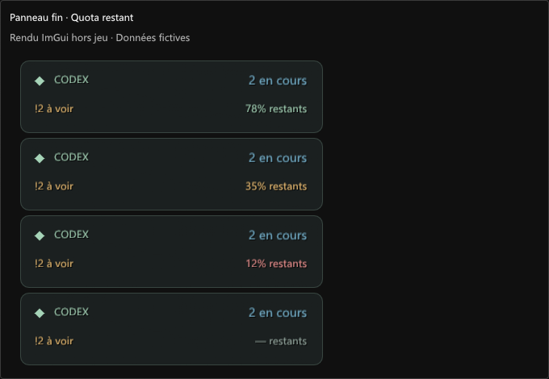

# Validation 0.8.0

Prérelease expérimentale. Vérifications locales le 7 septembre 2026 sur Windows, Dalamud 15.0.3.2, .NET SDK 10.0.400 et Node.js 22.22.2.

- Compilation Release sans erreur ni avertissement.
- 157 contrôles C# existants passent : notifications, reprise après combat, historique, questions, quota, visibilité, géométrie et animations. Le parseur lit le relais déjà actif ; aucun relais n’est démarré ni arrêté pendant ces contrôles.
- 32 nouveaux contrôles vérifient les graphèmes Unicode, la troncature, les identifiants de tâches, le format du lien Codex, les doubles clics et l’erreur Windows.
- Six emojis sont réellement rasterisés en couleur avec DirectWrite/Direct2D/WIC : cloche, palette, insecte, développeuse avec teinte de peau, validation et fusée. Les tests vérifient les pixels colorés ; les aperçus utilisent ces mêmes images.
- Les clics ImGui vérifient le lien de la ligne et celui de la notification, la conservation de l’alerte, l’ouverture de l’historique pour un résumé et l’absence d’action depuis un aperçu. Le lancement Windows est simulé dans ce parcours pour ne pas ouvrir les tâches fictives.
- Cinq seuils vérifient les couleurs du quota, y compris 20 %, 50 % et la valeur inconnue. Les cinq interactions HUD passent : style, quota, ouverture, déplacement et verrouillage.
- Les 13 interactions de régression questions/design passent, ainsi que l’égalité des pixels des réglages après personnalisation des surfaces et la migration avec le sérialiseur Dalamud installé.
- Quatre interactions de visibilité et quatre vérifications de migration/persistance passent. Le scénario de rendu d’une notification verte interrompue par un combat conserve sa durée complète au retour.
- 21 nouveaux aperçus présentent les emojis, les boutons, les réglages et les couleurs du quota à largeur minimale et aux échelles 100/150/200 %. Les 32 vues de design, les huit vues de visibilité/connexion et les deux planches du README ont également été régénérées.

## Limites

Cette DLL 0.8.0 n’a pas été chargée dans FF14 pendant cette validation. Les rendus et clics ImGui sont réels, mais les services du jeu sont simulés. Le téléversement des textures par le service Dalamud et les transitions de combat réelles restent à confirmer en jeu.

Le lien `codex://threads/<identifiant>` a été retrouvé dans l’application installée. Un lien vers la tâche de développement a été remis à Windows sans erreur ; la navigation visible dans Codex n’a pas été contrôlée par automatisation du bureau. L’association du protocole doit exister et le format interne peut évoluer.

La couverture des emojis dépend de Segoe UI Emoji installée sur Windows. Les séquences composées sont conservées, mais tous les symboles Unicode récents et tous les drapeaux ne sont pas garantis. Le cache est limité à 256 images, préparées en arrière-plan ; aucun fichier de police ou pack d’emojis n’est distribué. Les bindings TerraFX proviennent de Dalamud.

Le relais embarqué et ses quatre ressources restent identiques à 0.7.0. Les tests de lancement/arrêt et les 20 tests Node documentés dans cette release précédente n’ont pas été répétés pour cette modification d’interface. Le plugin ne démarre aucun travail et ne répond ni n’approuve dans Codex. Le quota reste celui du compte CLI ; une donnée absente ou périmée reste inconnue.

## Aperçus

Rendus ImGui hors jeu, avec des données fictives.
