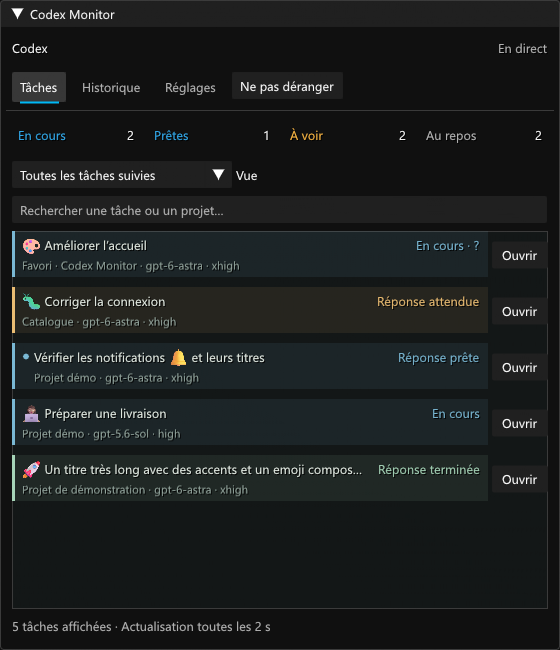
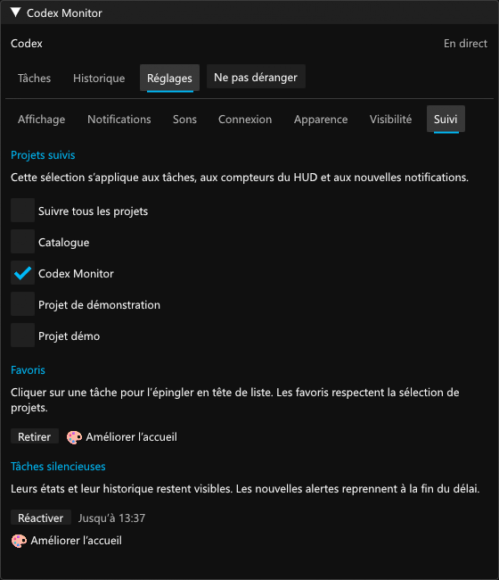
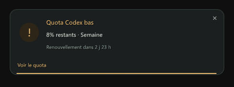

# Validation 0.10.0

Prérelease expérimentale. Vérifications locales le 7 septembre 2026 sur Windows, Dalamud 15.0.3.2, .NET SDK 10.0.400 et Node.js 22.22.2.

- Compilation Release sans erreur ni avertissement.
- **243 contrôles C#** : lecture Codex, modèle/effort, sélection de projets, favoris, silence temporaire, rafales, quotas, reconnexion, historique, pauses et logique existante.
- **23 tests Node** : protocole local, projection de modèle/effort/lecture sans prompts, questions, quota et journaux bornés.
- **16 contrôles du lanceur** sur un service Node fictif : cycle de vie, absence de doublon, relais externe préservé et nettoyage limité aux dossiers reconnus.
- **193 contrôles ImGui, 44 vues et 72 clics de compteurs** sur six HUD à 100/150/200 %, largeur minimale, modèle/effort, vues prêtes, favoris/silence, historique, suivi, diagnostic, quota et migration avec le sérialiseur Dalamud installé.
- **78 contrôles ImGui et 49 vues de régression** : questions inactives, pause/reprise, connexion, quota et longues listes.
- Les **13 interactions questions/design**, la comparaison pixel à pixel des réglages avant/après personnalisation des surfaces, les liens de navigation et les cinq interactions HUD existantes passent.
- Le vrai relais intégré 0.10.0 a été lancé temporairement sur un port libre puis arrêté. Le contrat C# a confirmé modèle, effort, état de lecture et quota disponible. Le diagnostic guidé a vérifié Node et la connexion réelle de Codex. Les cinq scripts intégrés sont vérifiés à la livraison.

## Performance

Harnais ImGui hors jeu, fenêtre 800 × 650, 40 images de chauffe et 120 mesures, avec 200 titres de 1 500 caractères : **0,12 ms médian**, **0,14 ms au 95e percentile**, environ **5,1 ko alloués par image**. La rasterisation des captures est exclue. Ces valeurs ne mesurent pas les FPS de FF14.

## Limites

Cette DLL n’a pas été chargée dans FF14 pendant la validation. Les composants et les clics ImGui sont réels ; les services du jeu et les lancements de liens de tâches fictives sont simulés. Le démarrage à la connexion au personnage, les transitions de combat et le chargement des textures par Dalamud restent à confirmer en jeu.

Le flux local `codex-ipc` v11 a confirmé `hasUnreadTurn`, les paramètres de modèle/effort et leur structure. Les bascules lu/non lu et les changements de modèle sont testés avec des snapshots et patches fictifs ; cette validation n’a pas marqué de tâche réelle comme lue ou non lue. Le signal décrit une réponse non lue, pas l’accomplissement de l’objectif entier. Le protocole et les liens `codex://threads/<UUID>` sont internes et peuvent évoluer.

Les captures sont des rendus ImGui hors jeu avec des tâches et diagnostics fictifs. Elles ne contiennent pas de conversations réelles. Les titres, identifiants, historiques, paramètres locaux et traces du relais ne sont pas publiés. Le diagnostic copiable utilise uniquement des libellés techniques autorisés.

Expressway n’étant pas installée dans l’environnement de test, son repli est validé. Aucun fichier de police, asset du jeu ou binaire tiers n’est redistribué.

Les [considérations techniques Dalamud](https://dalamud.dev/plugin-development/technical-considerations/) et les [restrictions de publication](https://dalamud.dev/plugin-publishing/restrictions/) ont été relues. Cette livraison utilise le dépôt personnalisé expérimental ; elle ne soumet rien au catalogue officiel.

## Aperçus

Rendus ImGui hors jeu, données fictives.
