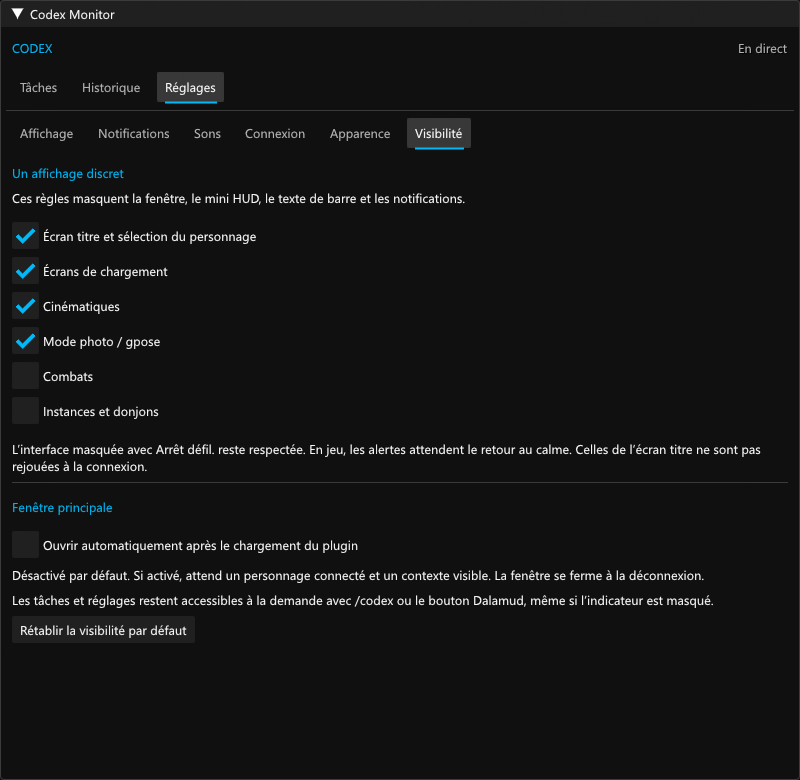
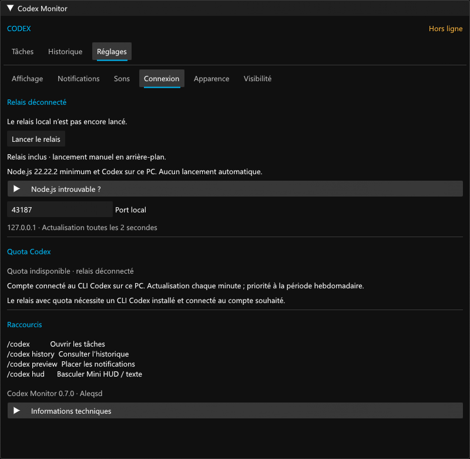

# Validation 0.7.0

Prérelease expérimentale. Vérifications locales le 7 septembre 2026 sur Windows, Dalamud 15.0.3.2, .NET SDK 10.0.400 et Node.js 22.22.2.

- 157 contrôles C# : masquage selon le contexte, absence de rattrapage après l’écran titre, reprise complète des notifications, questions, historique, quota, géométrie et animations.
- Le vrai relais intégré a été extrait et lancé depuis le lanceur C#, sur le port 43187 préalablement libre. Le parseur du plugin a reçu les états de Codex ; l’arrêt coopératif a ensuite libéré le port. Aucun autre relais n’a été arrêté.
- 14 contrôles du lanceur utilisent Node.js et un service fictif isolé, sans accès à Codex : double clic, chemins avec espaces/apostrophe, relais déjà actif même sans Codex connecté, conservation d’une instance externe, arrêt, relance, déchargement, port occupé, Node absent et copie de scripts modifiée.
- 20 tests Node couvrent le protocole local, les questions et le lecteur de quota.
- 4 interactions ImGui natives couvrent les options de visibilité et leur réinitialisation. 4 contrôles avec le sérialiseur Newtonsoft.Json installé dans Dalamud vérifient la migration et la persistance des choix explicites.
- Les 13 interactions de régression questions/design passent, ainsi que l’égalité pixel par pixel des réglages après personnalisation des autres surfaces.
- 8 aperçus des panneaux Visibilité et Connexion sont générés depuis les composants réels, à largeur minimale et aux échelles 100/150/200 %. Les contrôles du bas restent accessibles par défilement.

## Limites

Cette DLL 0.7.0 n’a pas été chargée dans FF14 pendant cette validation. Les services Dalamud de connexion, cinématiques, mode photo et instances sont reliés dans le code compilé ; leurs transitions réelles restent à vérifier en jeu. Les images et interactions ImGui utilisent des services hôtes simulés et des données fictives.

L’arrêt coopératif est testé avec le vrai relais hors jeu ; l’appel Dispose du lanceur est testé avec le service fictif. Le relais intégré surveille aussi l’existence du processus parent, mais la fermeture brutale de FF14 n’a pas été provoquée pour ce test. Node.js et le CLI Codex restent externes ; aucun runtime ni identifiant de compte n’est inclus dans la DLL.

La migration désactive une seule fois l’ancien défaut d’ouverture automatique. Elle conserve les couleurs, positions, historiques et autres préférences ; une réactivation explicite ultérieure reste enregistrée. Le masquage hors jeu abandonne les alertes différées, tandis qu’un masquage temporaire en jeu les reporte avec leur durée complète.

Le protocole interne de Codex peut évoluer. Le plugin ne lance, n’interrompt, ne répond et n’approuve aucune tâche. Le compte du quota reste celui du CLI. Les limites absentes ou périmées restent inconnues.

## Aperçus

Rendus ImGui hors jeu, avec des données fictives.
