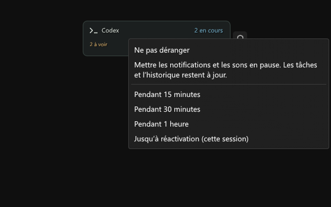

# Validation 0.9.0

Prérelease expérimentale. Vérifications locales le 7 septembre 2026 sur Windows, Dalamud 15.0.3.2, .NET SDK 10.0.400 et Node.js 22.22.2.

- Compilation Release sans erreur ni avertissement.
- **203 contrôles C#** : pause manuelle et expiration, résumé unique, questions résolues, démarrage automatique facultatif et tentatives bornées, filtrage, cache, quota, reprise après combat, historique, visibilité et animations.
- **32 contrôles Unicode et liens** : graphèmes, limites des titres, UUID, doubles clics et erreurs Windows. Les nouveaux contrôles vérifient aussi que l’erreur appartient à la bonne tâche et expire.
- **22 tests Node** : protocole local, questions, quota, diagnostics sans données de compte et rotation des journaux.
- **16 contrôles du lanceur Node** sur un service fictif : lancement/arrêt, absence de doublon, relais externe préservé, erreur de configuration et nettoyage réservé aux dossiers terminés reconnus.
- **78 contrôles ImGui et 49 aperçus** : tâche inactive avec question dans « À voir », commandes de pause sur les six HUD, reprise sans ouverture de tâche, connexion/quota, échelles 100/150/200 %, largeur minimale et défilement de titres longs.
- **Trois contrôles du sérialiseur Dalamud installé** pour les nouvelles préférences ; les 13 interactions questions/design et les contrôles existants de migration passent également. Les réglages conservent leurs pixels quand les surfaces fonctionnelles sont personnalisées.
- Les clics de navigation, les cinq interactions HUD et la notification verte interrompue par un combat simulé passent. Les lancements de tâches fictives sont simulés.
- Le relais réel 0.9.0 a été lancé temporairement sur un port libre avec ses **cinq scripts intégrés**. La lecture locale a confirmé sa version, un diagnostic de quota `ready` et une valeur disponible. L’arrêt de cette instance et la libération du port ont été confirmés. Aucun autre relais n’a été arrêté.

## Performance

Test hors jeu, même harnais ImGui et fenêtre 800 × 650 : 40 images de chauffe puis 120 mesures. Avec 200 titres de 1 500 caractères, le temps médian de préparation d’une image est passé d’environ **44,1 ms à 0,11 ms**, avec environ **4,7 ko d’allocations par image** au lieu de 70,5 Mo. Les lignes invisibles ne sont plus préparées et les résultats de mesure sont réutilisés. La rasterisation CPU des captures est exclue du chronométrage.

Ce cas limite est accepté par le contrat du relais. Ces résultats ne mesurent pas les FPS de FF14 et ne prouvent pas un ralentissement antérieur dans une partie réelle.

## Limites

La DLL 0.9.0 n’a pas été chargée dans FF14 pendant cette validation. Les composants et clics ImGui sont réels ; les services du jeu sont simulés. Le lancement automatique après une connexion réelle au personnage, les transitions de combat et le téléversement des textures par le service Dalamud restent à confirmer en jeu.

Les liens `codex://threads/<UUID>` utilisent l’association Windows. Le format a été retrouvé dans l’application installée, mais il n’est pas une API publique garantie. Aucun test n’a envoyé de message, lancé de travail ou répondu à une question dans Codex.

Les emojis dépendent de Segoe UI Emoji installée. Le cache de 256 textures tente jusqu’à trois préparations espacées avant de conserver un symbole de remplacement. Aucun fichier de police, asset de jeu ou binaire tiers n’est redistribué. Expressway n’étant pas installée dans l’environnement de test, son repli a été vérifié, pas son rendu exact.

Les [considérations techniques Dalamud](https://dalamud.dev/plugin-development/technical-considerations/), les [restrictions de publication](https://dalamud.dev/plugin-publishing/restrictions/) et la [politique IA des soumissions officielles](https://dalamud.dev/plugin-publishing/ai-policy/) ont été relues. Cette distribution reste un dépôt personnalisé expérimental, sans soumission au catalogue officiel dans cette livraison.

## Aperçus

Rendus ImGui hors jeu, avec des données fictives.
